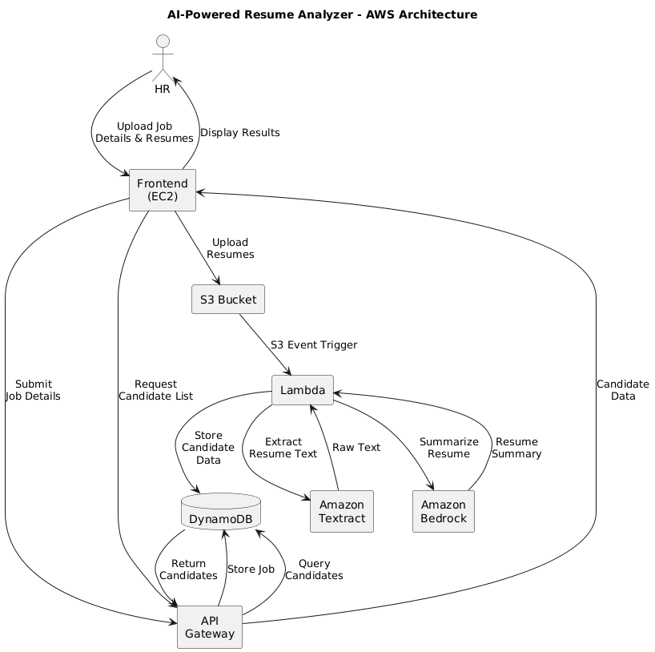
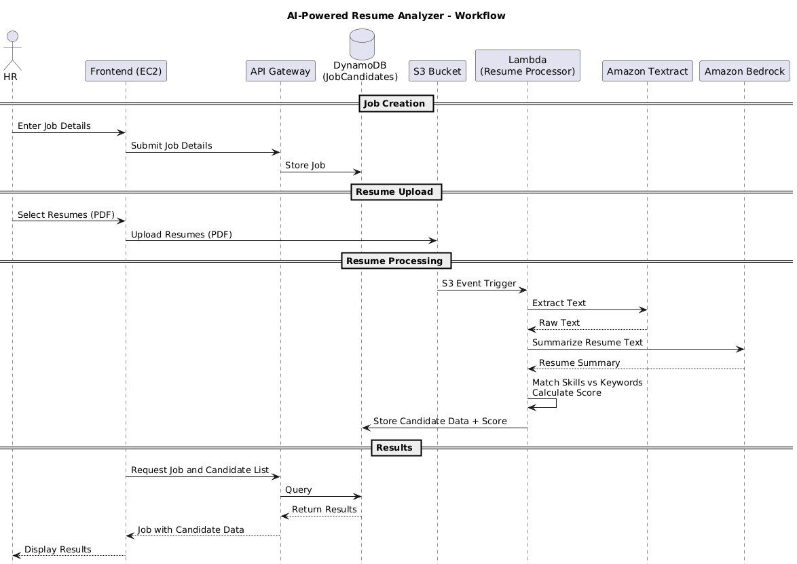

# AI-Powered Resume Analyzer

This assignment was developed for the Distributed Computer Systems (DCS) course to
demonstrate the use of cloud-based infrastructure, particularly **AWS services**
to build a scalable, serverless, AI-powered resume analyzer for HR
professionals.

It enables recruiters to:

- upload job openings
- upload and manage resumes in batch for automated processing

---

## 🚀 Workflow

1. **HR enters Job Details**

   - Inputs job title, description, and keywords.
   - Job details are stored in **DynamoDB** table: `JobCandidates`.
2. **Resume Upload**

   - HR uploads resume(s) in PDF format.
   - Resumes are stored in **Amazon S3** bucket.
3. **S3 Trigger**

   - Each resume upload triggers a **Lambda function**.
4. **Resume Processing (Lambda)**

   - Extracts key information (name, email, phone, skills, education,
     experience) using **Amazon Textract.**
   - Uses **Amazon Bedrock** for resume summarization.
5. **Candidate Data Storage**

   - Candidate information is saved in **DynamoDB**, linked to the job.
6. **Scoring Mechanism**

   - Lambda compares candidate skills against job keywords.
   - Score = number of matched keywords (e.g., 2 matches → score = 2).
7. **Frontend Display**

   - Candidate data and scores are retrieved from DynamoDB.
   - Displayed in a **React/Bootstrap UI**.
8. **API Gateway**

   - Provides CRUD operations to interact with DynamoDB and backend.
9. **Hosting**

   - The dynamic website is hosted on **Amazon EC2**.

---

## 🏗️ AWS Architecture

**Services Used**

- **Amazon S3** → Stores uploaded resumes.
- **AWS Lambda** → Processes resumes and computes scores.
- **AWS Textract** → Extract text from resumes.
- **Amazon Bedrock** → Generates AI-powered resume summaries.
- **Amazon DynamoDB** → Stores job postings and candidate data.
- **Amazon API Gateway** → Exposes APIs for CRUD operations.
- **Amazon EC2** → Hosts the web application.

---

## 📂 Data Model

### DynamoDB: `JobCandidates` Table

All data (both **jobs** and **candidates** ) is stored in a single DynamoDB
table called **`JobCandidates`** , using a **single-table design**.

- **Partition Key (PK):** `jobID`
- **Sort Key (SK):**

  - `"JOB"` → stores the Job entity
  - `"CANDIDATE#<candidateId>"` → stores Candidate entities for the job

1. Job Entity

| Attribute          | Type              | Description                                         |
| ------------------ | ----------------- | --------------------------------------------------- |
| `jobID`          | String (PK)       | Unique ID for the job. Example:`J_mf9dxxk1`       |
| `SK`             | String (SK)       | Always `"JOB"` for job entries                    |
| `jobTitle`       | String            | Title of the job (e.g.,`Fullstack Web Developer`) |
| `jobDescription` | String            | Description / responsibilities of the role          |
| `keyword`        | List `<String>` | List of skills/keywords required for the role       |
| `createdAt`      | ISO String        | Creation timestamp                                  |

2. Candidate Entity

| Attribute           | Type              | Description                                                      |
| ------------------- | ----------------- | ---------------------------------------------------------------- |
| `jobID`           | String (PK)       | Job which this candidate applied for.                            |
| `SK`              | String (SK)       | Format:`CANDIDATE#<candidateId>` Example: `C_mf9dy5zo` |
| `name`            | String            | Candidate' s full name                                           |
| `email`           | String            | Candidate' s email                                               |
| `phone`           | String            | Candidate' s phone number                                        |
| `education`       | List `<String>` | List of education records                                        |
| `experience`      | List `<String>` | Work experiences                                                 |
| `skills`          | List `<String>` | Extracted technical & soft skills                                |
| `matchedCriteria` | List `<String>` | Keywords from job description matched                            |
| `score`           | Number            | Count of matched keywords                                        |
| `summary`         | String            | LLM (Bedrock) generated candidate summary                        |
| `resumePath`      | String (S3 path)  | Location of uploaded resume in S3                                |
| `createdAt`       | ISO String        | Creation timestamp                                               |

---

## 📡 API Reference

**Jobs**

| Method     | Endpoint      | Description                |
| ---------- | ------------- | -------------------------- |
| `GET`    | `/jobs`     | Get all job postings       |
| `POST`   | `/jobs`     | Create a new job posting   |
| `GET`    | `/jobs/:id` | Get job details by ID*     |
| `DELETE` | `/jobs/:id` | Delete a job posting by ID |

\* Supports optional query parameter `limit` to restrict the number of
candidates, e.g. `/jobs/123?limit=3`.

**Candidates**

| Method   | Endpoint                 | Description                        |
| -------- | ------------------------ | ---------------------------------- |
| `GET`  | `/jobs/:id/candidates` | Get all candidates for a given job |
| `POST` | `/jobs/:id/candidates` | Add a candidate to a job           |

**Utilities**

| Method  | Endpoint     | Description                    |
| ------- | ------------ | ------------------------------ |
| `GET` | `/status`  | Health/status check for API    |
| `GET` | `/bedrock` | Test Amazon Bedrock connection |

---

## ⚙️ Deployment & Setup

### 1. Prerequisites

- AWS account
- IAM roles for S3, Lambda, DynamoDB, Bedrock access
- Node.js / Python for Lambda
- React + Bootstrap for frontend

### 2. Setup Steps

1. **DynamoDB**: Create `JobCandidates` table.
2. **S3**: Create bucket for resume uploads, enable event notification → Lambda
   trigger.
3. **Lambda**: Deploy function to:
   - Extract resume text
   - Call Bedrock
   - Store results in DynamoDB
4. **API Gateway**: Create REST API for CRUD operations.
5. **EC2**: Launch instance, deploy frontend app.

---

## ▶️ Running the App

- Visit app [here](http://ec2-54-179-123-73.ap-southeast-1.compute.amazonaws.com).
- Add a new job posting.
- Upload resumes.
- Resumes will be analyzed automatically.
- Candidate summaries and scores appear in job page.

---

## 📊 Example

**Job Posting Keywords**: `["Python", "AWS", "SQL"]`

**Resume Extracted Skills**: `["Python", "TensorFlow", "AWS"]`

✅ Matches = 2 → **Score = 2**

---

## 🧪 Future Enhancements

- Support more resume formats (DOCX, TXT)
- Advanced scoring using semantic matching (Bedrock embeddings)
- Notifications to HR when top candidates are found
- User authentication and access control

## Overall Architecture Diagram

## Sequence Diagram

